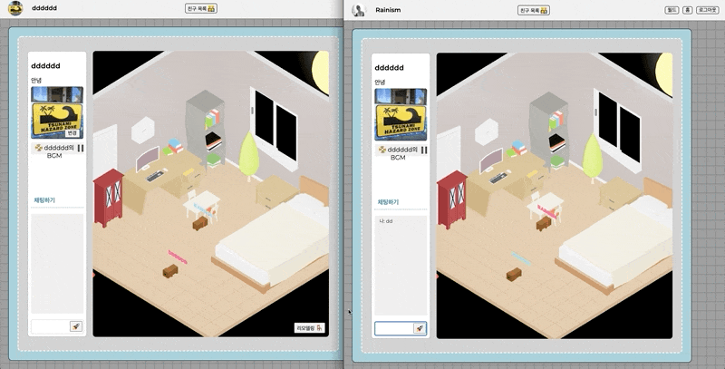
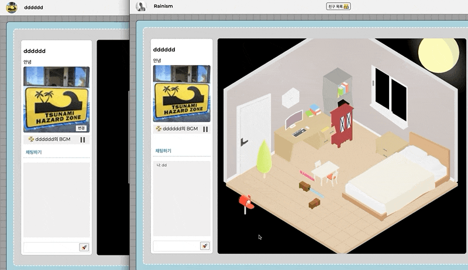
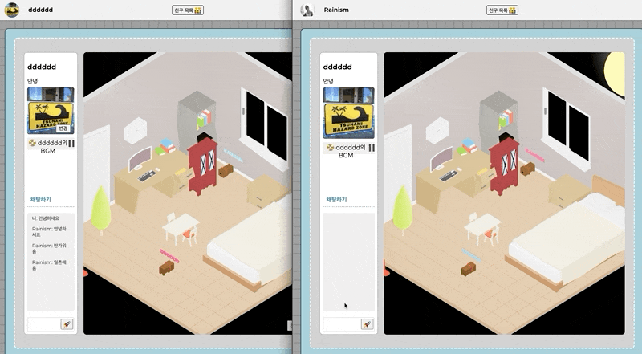

**Three-World** 🌐
=====
### **Let's create your first 3D home.**

당신의 집을 꾸미고, 친구와 교류하세요!
세상으로 나가 다른 사람의 집을 방문해보세요!

 

우리는 모두 움직이고, 상호작용이 일어나는 프로젝트를 만들고 싶었습니다.
3D javascript library인 [react-three-fiber](https://github.com/pmndrs/react-three-fiber)와 [게더타운](https://gather.town/)앱을 조사하면서 **웹소켓을 이용한, 3D로 움직이는 인터렉티브 웹앱**을 기획하게 되었습니다.

 

👌 **Members**  
===============

무엇을 말하든 (최악이 아니면) `그것도 좋은데요? 👍` 라고 말하는 **긍정적인** 사람들이 모인 팀입니다.

 

🙆🏻 **김민우** _3D 모델 쇼핑 VIP_

시간이 지나면 무조건 무언가를 만들어내는 생산성 200%의 금손과 미적 감각을 가진 팀내의 아트디렉터  
강남의 건물주가 부럽지 않을 정도로 월드맵에 3D 빌딩을 많이 올렸습니다.

 

🙆🏻‍♂️ **김성진** _다사다난한 만 아홉수_

컴퓨터의 네트워크 문제로 핸드폰 테더링에 의지해 서버를 만들고, 지갑을 분실하고, 캬라멜을 먹다 치과를.. 다녀와야 했지만 그 와중에도 로직과 꼼꼼한 코드리뷰로 팀내의 조장을 맡았습니다.  

 

🙆🏻‍♀️ **박소윤** _우선순위 컴파일러_

에러만 보면 열정러로 변신해 해결해버리고마는 코딩계의 백종원  
노션으로 일정관리를 하루에도 5번씩 해대는 의지의 인간 스케쥴러입니다.  

 
 

🛠 **Tech Stack** 🛠
===============

Base  
`react`

Global state management  
`redux`, `react-redux`, `@redux-toolkit`

Style  
`styled-component`

Web-socket  
`socket.io-client`

3D render  
`three`, `@react-three/fiber`, `@react-three/cannon`, `@react-three/drei`, `react-spring`

Convention Management  
`eslint`, `eslint-config-airbnb`

Version Management  
`github`, `source tree`  

 
 

**Features**
===============

- 메인페이지에서 three-world를 체험하며, 구글 계정을 통해 로그인을 할 수 있습니다.
- 프로필을 수정할 수 있고, BGM을 재생/정지할 수 있습니다.
- 방향키를 이용해 캐릭터를 조작할 수 있습니다.
- 방의 가구배치를 수정할 수 있습니다.
- 월드를 통해 랜덤한 유저들의 방을 방문할 수 있습니다.
- 방문한 유저를 일촌으로 추가할 수 있습니다.
- 친구집을 방문하여 방명록을 작성할 수 있습니다.
- 같은 공간에 있는 사용자들은 캐릭터를 통해 함께 이동하고, 소셜채팅을 할 수 있습니다.

| 로그인 | 캐릭터 이동 및 가구변경 |
| --- | --- |
|  | |
| 채팅 | 방명록 |
|  | |
| 월드 | 추가기능 (또는 에러핸들링) |
|  | |

 

### **three.js VS react-three-fiber**  
Component단위로 개발을 진행하기 위하여 `react-three/fiber`를 메인 라이브러리로 선택하였습니다.  
⛔ 업데이트가 활발히 진행중인 library여서, deprecated가 생길 위험요소가 존재한다.  
⛔ three.js에 비해 참고할 자료가 부족하다.  
✅ react의 다양한 hook과 기능을 사용할 수 있다.  
✅ 함수형 컴포넌트로 프로젝트의 통일성을 유지할 수 있다.  

 

### **redux toolkit**  
코드의 가독성과 짧은 개발 기간동안 효율성을 높이기 위해 선택하였습니다.  
⛔ redux-toolkit에 익숙하지 않아, 초기 기능 파악의 시간이 필요하다.  
✅ redux의 boiler plate를 획기적으로 줄여줄 수 있어, 장기적으로 시간을 절약할 수 있다.  
✅ 코드의 가독성 향상으로, 이후 기능확장과 유지보수 시점에서 이점을 갖을 수 있다.  
✅ 꼭 필요한 기능의 파악에 집중하면, 초기 학습 시간을 단축할 수 있다.  

 
 

**Challenges**
===============

### 1. login/logout  

 

⛔ 기존에는 client에서 브라우저 내의 cookie를 직접 삭제하는 방식으로 logout을 구현하였으나, client와 server를 각각 배포 후 cookie가 삭제되지 않는 문제가 발생하였습니다.  
✅ client의 도메인과 server의 도메인이 달라서, client에서 server 도메인의 cookie에 접근하지 못하는 것이 문제였습니다.  
✅ server에 요청을 보내서 cookie를 삭제하는 방식으로 logout 기능을 수정하였습니다.  

 

### 2. 최적화 지옥

    1) 소켓  
    ⛔ 케릭터 이동에 의한 통신 시 리렌더링을 줄이고자 이벤트의 on, emit 위치를 해당 component내부로 분리하자, 여러 컴포넌트에서 소켓을 사용하기 때문에 디버깅이 어려워졌었습니다.  
    ⛔ 과거의 경험에 기반하여 socket연결을 custom hook으로 useEffect내부에서 연결 후 state에 할당하자, 무의미한 재렌더링이 유발되는 경우가 발생했습니다.  
    ✅ 소켓관련 로직을 유틸로 분리하여, 흩어져있는 로직을 한눈에 확인할 수 있도록 수정하였습니다.  
    ✅ component가 바뀔때마다 불필요하게 socket이 re-connect되던 방식을, util함수가 import될때 최초 한번 연결하는 방식으로 수정하였습니다.  

   

    2) 캐릭터 이동
    ⛔ 이동정보를 state로 관리하여, 리랜더링이 일어나는 방식이었습니다.  
    ✅ useRef를 이용하여, 이동정보가 변경되어도 리랜더링되지않도록 최적화하였습니다.  

   

    3) Canvas re-mount
    ⛔ 친구집 방문 시 socket의 on이벤트 정리와 state 초기화를 위해 Canvas를 re-mount시키는 방식을 사용하고 있었습니다. 목적에 비해 react-three-fiber의 canvas 전체를 re-mount시키는 것은 비용이 매우 크다고 판단하였습니다.  
    ✅ 방을 이동했다는 정보의 flag를 이용하여 socket 이벤트를 정리하고 state를 초기화하는 방식으로 수정하였습니다.

   

    4) Flag를 이용한 state 초기화

    Canvas를 re-mount시키지 않는 방식으로 적용을 하니, 내부의 state를 flag를 이용하여 초기화시켜줘야 했습니다.  
    re-mount를 줄여 리소스를 아낄 수 있다는 이점을 얻었으나, 초기화가 필요한 state들을 모두 핸들링하는 과정에서 놓치는 부분이 생겼습니다.  
    최적화의 이점을 얻으려고 노력하다보니 핸들링해줘야 하는 부분이 많아 코드의 양이 늘어나기도 했습니다. 이 때문에 일정이 늦춰지기도 했고, 최적화를 하려다 가독성을 낮추는 건 아닐까에 대해 고민도 하게 되었습니다.  
    최적화를 할 때에는 이런 부분들 또한 중요하다는 것을 알게 되는 경험이였습니다.  

 

### 3. Database

Mongoose를 써보면서 ODM의 위력을 많이 느낄 수 있었습니다. 다양한 메소드를 통해 데이터를 관리할 수 있다는 점이 매우 좋았습니다. 그리고 스키마의 수정이 자유로워서 그만큼 많이 바꿀 수 있어서 스키마를 다양하게 시도해 볼 수 있었습니다.

> ### Schema unique 오류
> ⛔ 회원가입을 진행하면 user schema의 friends column에서 duplicate error가 발생했습니다.  
> friends에는 unique옵션도 주지않았으며, 최초 가입시에는 해당 목록이 비어있음에도 오류가 발생하며 회원가입이 되지 않았습니다.  
> mongoose는 indexes를 삭제하지 않기때문에, user schema의 friends에 `unique: true`를 잠시 준 이력이 원인이었습니다.   
> ✅ user schema의 email에 index를 주고 있었으므로, mongoose connect시 createIndexes를 추가하고, 해당 index를 drop하는 것으로 문제를 해결했습니다.  
> db가 축적된 이후 schema를 수정하는 것의 위험성과 초기 schema 설계의 중요성을 느낄 수 있었습니다.  

 

 

### 4. React-three-fiber
Three.js를 토대로 만들어진 리액트 라이브러리이기 때문에 `리액트 + Three.js` 라고 생각했었으나 큰 오산이였습니다.
리액트도 아닌, Three.js도 아닌 부분이 있었기 때문입니다.

> ### Canvas Ref  
> `React-three-fiber`에서 제공하는 캔버스는 `html canvas tag`가 아니여서 직접적으로 canvas에 blur 이벤트나 focus 이벤트를 걸 수 없었습니다.  
> `React-three-fiber`의 Canvas를 감싸는 `div tag`를 추가하고 blur 및 focus 이벤트를 걸어 해결했습니다.  

 

> ### useDispatch  
> 캔버스는 클래스형 컴포넌트이기 때문에 useDispatch를 사용할 수 없어서 Redux-Thunk를 이용하기 위해 상위 컴포넌트에서 props로 내려주어야 했습니다.  

 

### 5. 새로고침 시, GLTF 오류

⛔ url에 친구의 방 주소를 직접 입력하거나, 새로고침할때 gltf파일을 로드하는 부분에서 오류가 발생했습니다.  
✅ react-three-fiber에 useGLTF.preload라는 gltf파일을 사전에 로드해주는 메소드가 있는데, 해당 메소드가 import당시 실행됨을 확인했습니다.  
친구의 방 주소를 직접 입력하거나, 방에서 새로고침 시 gltf파일을 올바르지 않은 경로로 요청한다는 사실을 확인하였습니다.  
기존 browser router에서 hash router로 수정 적용하여, gltf파일을 요청하는 경로를 일관되게 만들어줌으로 문제를 해결하였습니다.  
✅ 라이브러리의 내부에서 발생하는 오류를 파악하는 것이 쉽지 않다는 것을 느꼈고, 라이브러리의 사용에서 오류가 발생했을때 문제를 파악하고 해결하기 위해서, 라이브러리의 메소드를 사용할때 좀 더 깊은 이해가 동반되어야 한다는 것을 느끼게 되었습니다.  

 
 

**팀프로젝트를 진행하면서 느낀 점들**
================

 

### 1. 일정관리
Agile Project Management 방식을 쓰기로 했기 때문에 최대한 자세하게 단계를 나누고 진행했음에도 불구하고, 업무분담을 효율적으로 하는 것이 쉽지 않았습니다. 기능의 중요도와 구현의 난이도가 항상 비례하는 것도 아니였기 때문에, 상대적으로 중요한 기능이 아닌데도 많은 시간을 할애해야 하는 경우가 많았습니다. 그래서 Task Card를 쓸 때의 예상 시간과의 괴리가 커서 일정이 당겨지기도, 늦어지기도 하는 어려움이 있었습니다.  

 

### 2. 업무분담
굵직한 스케쥴을 짜놓고 매일아침 다시 모여서 회의하며 ToDo를 할당했었는데 뷰/서버/3D/소켓 등 나눠지는 부분이 많아서 균등하게 나누는 것이 얼마나 힘든지에 대해 많이 생각하게 되었습니다.
그렇지만 기능들이 하나의 컴포넌트 안에서 함께 일어나는 일이 많아, 한명이 한가지 기능을 도맡아 하는 일은 거의 없었습니다. 덕분에 코드컨벤션을 더 많이 맞출 수 있었고, 최적화를 위한 리팩토링을 많이 해볼 수 있었습니다.  

 

### 3. 의사결정
개발을 진행하며 어떠한 방식으로 로직을 작성할 것인가를 선택해야하는 순간들이 있었습니다.
혼자 프로젝트를 진행할때와는 달리, 원하는 방향이 있다면 적절한 근거를 기반으로 팀원을 설득해야했습니다.
회의를 하며 잘못생각했던 부분들을 깨닫기도하고, 몰랐던 부분들을 알게되는 기회가 되었습니다.
혼자 고민하고 선택하는 것보다 시간은 소요되겠지만, 그만큼 깊게 생각하고 공부할 수 있어서 많은 도움이 되었다고 생각합니다.
